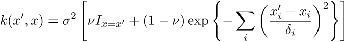
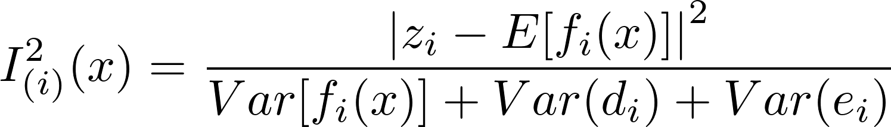

# GP_emu_UQSA

```
===============    _(o> ==================
  GP_emu_UQSA   ¬(GP)     by Sam Coveney  
===============   ||    ==================
```
________

GP_emu_UQSA is a Python package written by [Sam Coveney](https://uk.linkedin.com/in/sam-coveney-3a179ab9) to train a Gaussian Process Emulator and use it for uncertainty quantification and sensitivity analysis. It uses simple routines to encapsulate the methodology of the [MUCM Toolkit](http://mucm.aston.ac.uk).

[](https://zenodo.org/badge/latestdoi/73758121)

To install GP_emu_UQSA, download/clone the package and run the following command inside the top directory:
```
python setup.py install
```

## Acknowledgements
GP_emu_UQSA uses the python packages NumPy, SciPy, and Matplotlib.

[Richard Clayton](http://staffwww.dcs.shef.ac.uk/people/R.Clayton) and [Eugene Chang](https://uk.linkedin.com/in/eugene-chang-0854505b) deserve particular acknowledgement for their valuable assistance in the form of discussions, code samples, and testing during the creation of GP_emu_UQSA. [Barbara Johnston](https://www.griffith.edu.au/science-aviation/school-natural-sciences/staff/barbara-johnston) also helped greatly via extensive and patient use of the code as it was developed.

Additionally, discussions on Gaussian Processes with [Richard Wilkinson](http://maths.dept.shef.ac.uk/maths/staff_info_688.html) and [Jeremy Oakley](http://www.jeremy-oakley.staff.shef.ac.uk/) were very helpful, and [Mike Croucher](https://uk.linkedin.com/in/mike-croucher-32336113) advised on the software development early on.

The [MUCM toolkit](http://mucm.aston.ac.uk) was an invaluable resource in creating GP_emu_UQSA.

Table of Contents
=================
* [Theory](#Theory)
* [Building an Emulator](#Building_an_Emulator)
  * [Main Script](#Main_Script)
  * [Config File](#Config_File)
  * [Beliefs File](#Beliefs_File)
  * [Fitting an emulator](#Fitting_an_emulator)
  * [Reconstruct an emulator](#Reconstruct_an_emulator)
* [Design Input Data](#Design_Input_Data)
* [Uncertainty and Sensitivity Analysis](#Uncertainty_and_Sensitivity_Analysis)
    * [Uncertainty](#Uncertainty)
    * [Sensitivity](#Sensitivity)
    * [Main Effects](#Main_Effects)
* [History Matching](#History_Matching)
    * [Implausibility plots](#Implausibility_plots)
    * [Filter non-implausible values](#Filter_non-implausible_values)
    * [New wave input design](#New_wave_input_design)
* [Noise Fit](#Noise_Fit)
* [Examples](#Examples)
  * [Simple toy simulator](#Simple_toy_simulator)
  * [Sensitivity examples](#Sensitivity_examples)
* [Extra functions](#Extra_functions)


## Theory <a name="Theory"/>

GP_emu_UQSA uses the [methodology of MUCM](http://mucm.aston.ac.uk) for building, training, and validating an emulator. 

Theory about Gaussian Processes can be found in the exemplary textbook [Gaussian Processes for Machine Learning](http://www.gaussianprocess.org/gpml/)

GP_emu_UQSA uses a Gaussian Kernel with Nugget:




## Building an Emulator <a name="Building_an_Emulator"/>

The user should create a project directory (separate from the GP_emu_UQSA download), and within it place a configuration file, a beliefs file, and an emulator script containing GP_emu_UQSA routines (the directory and these files can be created automatically - see [Create files automatically](#Create_files_automatically)). Separate inputs and outputs files should also be placed in this new directory.

The idea is to specify beliefs (e.g. form of mean function, values of hyperparameters) in the beliefs file, specify filenames and fitting options in the configuration file, and call GP_emu_UQSA routines with a script. The main script can be easily editted to specifiy using different configuration files and beliefs files, allowing the user's focus to be entirely on fitting the emulator.

A routine ```create_emulator_files()``` is provided to create a directory containing default belief, config, and main script files. This is to allow the user to easily set up different emulators.

It is simplest to run this function from an interactive python session as follows:
```
>>> import gp_emu_uqsa as g
>>> g.create_emulator_files()
```
The function will then prompt the user for input.


Emulators should be trained on a design data set e.g. optimized latin hypercube design. See [Design Input Data](#Design_Input_Data).


### Main Script <a name="Main_Script"/>

This script runs a series of functions in GP_emu_UQSA which automatically perform the main tasks outlined above. This allows flexibility for the user to create several different scripts for trying to fit an emulator to their data.

```
import gp_emu_uqsa as g

#### setup emulator with configuration file
emul = g.setup("toy-sim_config")

#### train emulator and run validation diagnostics
g.train(emul)

#### plot full prediction, "mean" or "var"
g.plot(emul, [0,1], [2], [0.65], "mean")
```

The configuration file is explained later.

#### setup

The setup function needs to be supplied with a configuation file, and can be supplied with two extra options:
```
emul = g.setup(configfilename, datashuffle = True, scaleinputs = True)
```

The option ```datashuffle = False``` (default ```True```) prevents the random shuffling of the inputs and outputs (which may be useful when the data is a timeseries or when the user wishes to use the same subsets of data for their training and validation sets).

The option ```scaleinputs = False``` (default ```True```) prevents each input dimension from being scaled into the range 0 to 1(or scaled by the optional ```input_minmax``` in the beliefs file).


#### train

The function ```train()``` will perform training and validation diagnostics.

* if there are validation data sets available, then the emulator trains on the current training data and validates against the current validation set. Afterwards, a prompt will ask whether the user wants to include the current validation set into the training set (recommended if validation diagnostics were bad) and retrain.

* An optional argument ```auto``` (default ```True```) can be given to toggle on/off the automatic retraining of the emulator with the current validation data included in the training data.

* An optional argument ```message``` (default ```False```) can be given to toggle on/off the printing of messages from underlying optimization routines (these messages may help identify problems with fitting an emulator to the data).

* An optional argument ```no_retrain``` (default ```False```) can be given, which prevents the automatic inclusion of the next validation set into the training set (after training and validation have taken place) followed by retraining. This may be useful since no user interaction is required (which would be the case if ```auto``` was set to ```False``` to prevent this automatic retraining).


#### plot

The full prediction (posterior distribution), either the mean or the variance, can be displayed as a plot. Plots can be 1D line plots or 2D colour maps.

* The first argument is the emulator object.

* 2D plots: the second argument is a list of which input dimensions to use for the (x,y)-axes

* 1D plots: the second argument is a list of the input dimension to use for the x-axis

* The third argument is a list of which input dimensions to set to constant values

* The fourth argument is a list of these constant values.

* The fifth argument ```mean_or_var``` (optional, default ```"mean"```) specifies whether to plot the mean (```"mean"```) or the variance (```"var"```).

* The sixth argument ```customLabels``` (optional) is a list of strings for the axes labels.

* The seventh argument ```points``` (optional, default ```False```) specifies whether to plot the training points on the plot as well. This will only work for 1D plots of the mean.

* The eighth argument ```predict``` (optional, default ```True```) is to distinguish between 'prediction' (True) and 'estimation' (False). In prediction, the nugget (representing noise or jitter) will be included on the diagonal of the covariance k(x\*,x\*) of the posterior variance, where x* represents inputs for which predictions (or estimations) are being made.

e.g. for a 1D plot of the variance with: input 0 varying from 0 to 1, inputs 1 and 2 held fixed at 0.10 and 0.20 respectively, x-label "input 0", plotted training points, and estimation (not prediction):
```
g.plot(emul, [0], [1,2], [0.10,0.20], "var", ["input 0"], True, False)
```

The posterior of the emulator object also contains routines for plotting 95% confidence intervals, although the user will have to write routines in their main script to call these routines and make plots of the confidence intervals.


### Config File <a name="Config_File"/>

The configuration file does two things:

1. Specifies the names of the beliefs file and data files e.g.
  ```
  beliefs toy-sim_beliefs
  inputs toy-sim_input
  outputs toy-sim_output
  ```

  The beliefs file is specified in the [Beliefs File](#Beliefs File) section.
  For the inputs (outputs) file, each row corresponds to a single data point. Whitespace separates each dimension of the input (output). Naturally, the i'th row in the inputs file corresponds to the i'th row in the outputs file.


2. Specifies options for training the emulator on the data e.g.
  ```
  tv_config 10 0 2
  delta_bounds [ ]
  sigma_bounds [ ]
  nugget_bounds [ ]
  tries 5
  constraints bounds
  ```

*The configuration file can be commented*, making it easy to test configurations without making a whole new config file e.g.
```
#delta_bounds [ [0.005 , 0.015] ]
delta_bounds [ [0.001 , 0.025] ]
```


#### tv_config

Specifies how the data is split into training and validation sets.

1. first value -- __10__ 0 2 -- how many sets to divide the data into (determines size of validation set - does not need to be a factor of the number of training points, remainders are added to the initial training set)

2. second value -- 10 __0__ 2 -- which V-set to initially validate against (currently, this should be set to zero; this mostly redundant feature is here to provide flexibility for implementing new features in the future)

3. third value -- 10 0 __2__ -- number of validation sets (determines number of training points)

| ```tv_config``` | data points | T points | V-set size | V sets  |
| ----------| ------------| -------- | ---------- | ------- |
| ```10 0 2```    | 200         | 160      | 20         | 2       |
| ```4 0 1```     | 100         | 75       | 25         | 1       |
| ```10 0 1```    | 100         | 90       | 10         | 1       |


#### delta_bounds and sigma_bounds and nugget_bounds

Sets bounds on the hyperparameters while fitting the emulator. These bounds will only be used if ```constraints bounds```, but *the constraints are always used as intervals in which to generate initial guesses for hyperparameter fitting*, therefore choosing good bounds is still important.

If the bounds are left empty, i.e. ```delta_bounds [ ]``` and ```sigma_bounds [ ]``` and ```nugget_bounds [ ]```, then they are automatically constructed, although these might not be suitable. The bounds on delta are based upon the range of inputs, and the bounds on sigma are based upon the largest output value, and the bounds on nugget are set to small values.

To set bounds, a list of lists must be constructed, the inner lists specifying the lower and upper range on each hyperparameter. For delta, some bounds may be specified and others left empty (as an empty list), in which case empty bounds are automatically constructed based on the range of inputs for that dimension.


| input dimension | delta_bounds                           | sigma_bounds     | nugget_bounds        |
| --------------- | ------------                           | ------------     | ------------         |
| 3               | ```[ [0.0, 1.0], [0.1, 0.9], [0.2, 0.8] ]``` | ```[ [0.05, 5.0] ]``` | ```[ ]``` |
| 3               | ```[ [ ], [0.1, 0.9], [ ] ]```                 | ```[ [0.05, 5.0] ]``` | ```[ [0.00001, 0.010] ]``` |
| 1               | ```[ [0.0, 1.0] ]```                         | ```[ ]``` | ```[ [0.001, 0.010] ]``` |


#### fitting options

* __tries__ : is how many times (integer) to try to fit the emulator for each round of training e.g. ``` tries 5 ```

* __constraints__ : which type of constraints to use, can be ```bounds``` (use the bounds in the configuration file), the default option ```standard``` (keep delta above a small value (0.001) for numerical stability), or ```none``` (unconstrained).


### Beliefs File <a name="Beliefs_File"/>

The beliefs file specifies beliefs about the data, namely which input dimensions are active, what mean function to use, and values of the hyperparameters (before training - this doesn't affect the training, except when using ```nugget_fix``` which will fix the nugget at the specified value).

```
active all
output 0
basis_str 1.0 x
basis_inf NA 0
beta 1.0 1.0
delta 1.0
sigma 1.0
nugget 0.0001
fix_nugget T
alt_nugget F
mucm F
```

#### choosing inputs and outputs

The input dimensions to be used for the emulator are specified by ```active```. For all input dimensions use ```active all```, else list the input dimensions (index starts at 0) e.g. ```active 0 2```.

The output dimension to build the emulator for is specified by ```output```. Only a single index should be given e.g. ```output 2``` will use column '2' (technically the third column) of the output file.


#### the mean function

The specifications of ```basis_str``` and ```basis_inf``` define the mean function. ```basis_str``` defines functions and ```basis_inf``` defines which input dimension correspond to those functions. ```__beta__``` defines the mean function hyperparameters. The initial values of ```beta``` do not affect the emulator training, so they can be set to 1.0 for simplicity.

For mean function m(__x__) = b0
```
basis_str 1.0
basis_inf NA
beta 1.0
```

For mean function m(__x__) = b0 + b0x0 + b2x2
```
basis_str 1.0 x x
basis_inf NA 0 2
beta 1.0 1.0 1.0
```

For mean function m(__x__) = b0 + b0x0 + b1x1^2 + b2x2^3
```
basis_str 1.0 x   x**2 x**3
basis_inf NA  0   1    2
beta      1.0 2.0 1.1  1.6
```

#### the hyperparameters delta and sigma

The hyperparameters should be listed. Care should be taken to specify as many delta as required e.g. if the input has 5 dimensions then delta requires 5 values, *but if only 3 input dimensions are active then only 3 delta should be given*.
```
delta 1.0 1.0 1.0
sigma 1.0
```
The initial values do not affect how the emulator is trained.


#### the nugget

The nugget can be specified and fixed (T) or not (F) by
```
nugget 0.001
fix_nugget T
```
The nugget has several functions:
* a very small value can be used to provide numerical stability, as it can make the covariance matrix better conditioned. For this function, the nugget should be set as small as possible and ```fix_nugget T``` (not trained during the emulator fitting) so as to leave the fitting of delta and sigma as unaffected as possible (though there is always an effect).
* the nugget can be trained along with delta and sigma if ```fix_nugget F``` which allows the emulator to be trained on noisy data (bear in mind that if some inputs are 'turned off' but these inactive inputs vary across the training data set, that the data effectively becomes noisey). In this case, an estimate of the noise variance is printed during training.

Furthermore, an option to use an alternative nugget is provided, and can be activated using
```
alt_nugget T
```
In this case, the nugget vanishes from everywhere specified in the kernel equation above, and is instead added to the resulting expression as "+ nugget squared". This allows the nugget to function in its more usual form as specified in [Gaussian Processes for Machine Learning](http://www.gaussianprocess.org/gpml/).

#### mucm option

The mucm option provides a choice of loglikelihood methods:
* ```mucm F``` uses the 'standard' loglikelihood expression for a gaussian process with explicit basis functions in the limit of vague priors - see [Gaussian Processes for Machine Learning](http://www.gaussianprocess.org/gpml/). This means that sigma is trained alongside the other hyperparameters.
* ```mucm T``` assumes that the priors on sigma are inversely proportional to sigma, which allows sigma to be treated as an analytic function of delta (sigma is not independantly optimised) - see papers and reports in the [MUCM Toolkit](http://mucm.aston.ac.uk).


### Fitting an emulator <a name="Fitting_an_emulator"/>

GP_emu_UQSA uses Scipy and Numpy routines for fitting the hyperparameters. The file \_emulatoroptimise.py contains the routine *minimize*, which can take additional arguments which GP_emu_UQSA (for simplicity) does not allow the user to specify at the moment. However, these additional arguments may make it easier to find the minimum of the negative loglikelihood function, and can easily be looked-up online and added to the code by the user (remember to reinstall your own version of GP_emu_UQSA should you choose to do this).


### Reconstruct an emulator <a name="Reconstruct_an_emulator"/>

When building an emulator, several files are saved at each step: an updated beliefs file and the inputs and outputs used in the construction of the emulator. The emulator can be rebuilt from these files without requiring another training run or build, since all the information is specified in these files. A minimal script would be:

```
import gp_emu_uqsa as g

emul = g.setup("toy-sim_config_reconst")

g.plot(emul, [0,1],[2],[0.3], "mean")
```
where "toy-sim_config_reconst" contains the names of files generated from previously training an emulator e.g.:
```
beliefs toy-sim_beliefs-2f
inputs toy-sim_input-o0-2f
outputs toy-sim_output-o0-2f
```

#### Be careful

*Be careful to specify the output correctly in the new beliefs file* - the updated output files from training an emulator will contain only a single column of outputs (the output for which the emulator was built, specified by ```output``` in the original beliefs file). For rebuilding an emulator, the beliefs file should specifiy that output 0 should be used (since we wish to use the first and only column of outputs in the updated output file). The updated beliefs file will specify ```output 0``` automatically, and contains ```output_index``` which specifies which output, relative to the original output file, was used for the original training.

*Be careful to specify the active inputs correctly in the new beliefs file* - the updated input files from training an emulator will contain only the active input dimensions (the inputs for which the emulator was build, specified by ```active``` in the original beliefs file), the updated inputs files will contain only these inputs. So inputs [0,2] of original inputs [0,1,2] will be indexed as [0,1] in the updated inputs file. The updated beliefs file will automatically specify ```active``` correctly, and ```active_index``` will specify which inputs were active relative to the original inputs file when the emulator was trained.

*Be especially careful with the tv_config option* - to reconstruct the emulator using all the training data (without calling the ```train``` function) then the last value of tv_config must be 0 - otherwise the hyperparameters will be set to the values from training, but not all the training data will be used.


## Design Input Data <a name="Design_Input_Data"/>

Currently, only an optimised Latin Hypercube design is included which uses the [implementation described by MUCM](http://mucm.aston.ac.uk/toolkit/index.php?page=AltCoreDesign.html). It may be possible to create more optimal designs that fill the input space more evenly using other packages or programs.

To import this subpackage use
```
import gp_emu_uqsa.design_inputs as d
```
It is advisable to use a simple python script to use this subpackage, since the script can be easily reconfigured

```
import gp_emu_uqsa.design_inputs as d

dim = 2
n = 60
N = 200
minmax = [ [0.0,1.0] , [0.0,1.0] ]
filename = "toy-sim_input"

d.optLatinHyperCube(dim, n, N, minmax, filename)
```
The design input points, output to _filename_, are suitable for reading by GP_emu_UQSA.

The extra optional argument ```fextra``` (default ```None```) can be used to supply a datafile of inputs (with ```dim``` number of columns). These may be inputs for simulation runs which we already have outputs for, and so don't need a new input design which includes datapoints too close to these ones. The produced design will be optimised taking the inputs in this file into account.
```
d.optLatinHyperCube(dim, n, N, minmax, filename, fextra)
```


## Uncertainty and Sensitivity Analysis <a name="Uncertainty_and_Sensitivity_Analysis"/>

See the following pages for MUCM's discussions on [uncertainty quantification](http://mucm.aston.ac.uk/toolkit/index.php?page=DiscUncertaintyAnalysis.html) and [sensitivity analysis](http://mucm.aston.ac.uk/toolkit/index.php?page=ThreadTopicSensitivityAnalysis.html).

The sensitivity subpackage can be used to perform uncertainty and sensitivity analysis. Currently, only a special case of an emulator with a Gaussian kernel and *a linear mean function* will work. The emulator inputs (which are formally treated as probability distributions in the analysis) are assumed to be independant and normally distributed with mean m and variance v.

### Setup

Include the sensitivity subpackage as follows:
```
import gp_emu_uqsa.sensitivity as s
```

A distribution for the inputs must be defined by a mean m and variance v for each input. These means and variances should be stored as a list e.g. for an emulator with 3 inputs with mean 0.50 and variance 0.02 for each input:

```
m = [0.50, 0.50, 0.50]
v = [0.02, 0.02, 0.02]
```

These lists and the emulator "emul" must then be passed to the sensitivity setup function which returns a Sensitivity class instance:

```
sens = s.setup(emul, m, v)
```

It should be noted that only the Uncertainty, Sensitivity, and Main Effect have been thoroughly tested against the examples in the MUCM Tookit, and that the Interaction Effect and the Total Effect Variance have not been formally tested.


### Uncertainty <a name="Uncertainty"/>

To perform uncertainty analysis to calculate, with respect to the emulator, the expection of the expection, the expection of the variance, and the variance of the expectation, use:
```
sens.uncertainty()
```


### Sensitivity <a name="Sensitivity"/>

To calculate sensitivity indices for each input, use:
```
sens.sensitivity()
```

To plot a sensitivity table of the normalised sensitivities (sensitivity indices divided by the expectation of the variance) use
```
s.sense_table([sens,])
```
where the first argument is a list containing Sensitivity instances.

Optional arguments ```inputNames``` and ```outputNames``` for the column titles (inputs) and the row titles (emulator outputs) can be specified as lists.

An optional integer argument ```rowHeight``` (default 6) can adjust the height of the table rows.

By looping over different emulators (presumably built to emulate different outputs) and building up a list of Sensitivity instances, ```sense_table``` can be used to produce a table displaying the sensitivity of every output for every input.

```
sense_list = [ ]
for i in range(number_of_emulators):

    ... setup emulator ...

    ... train emulator ...

    ... setup sensitivity ...

    ... run uncertainty() and sensitivity() routines ...

    sense_list.append(sens)

s.sense_table(sense_list)
```


### Main Effect <a name="Main_Effect"/>

To calculate the main effects of each input, and optionally plot them (default ```plot = False```) use:
```
sens.main_effect(plot=True)
```
The number of points to use for plotting can be specified (default ```points = 100```):
```
sens.main_effect(plot=True, points = 200)
```
Extra optional arguments for the plot can also be chosen for the key, labels, the plot scale (useful for adjusting the exact placement of the key) and to use colours and linestyles suitable for black and white printing:
```
sens.main_effect(plot=True, customKey=['Na','K'], customLabels=['Model Inputs','Main Effect for dV/dt'], plotShrink=0.9, black_white=True)
```
An optional argument for the subset of inputs to be calculated/plotted can be provide (default is all inputs) e.g. to plot only input 0 and input 2:
```
sens.main_effect(plot=False, w=[0,2])
```

### Save results to file

To save calculated sensitivity results to file, use the to_file function:
```
sens.to_file("test_sense_file")
```

### Interaction Effect

The interaction effect between two inputs {i,j} can be calculated and plotted with:
```
sens.interaction_effect(i, j)
```
Optional arguments can be supplied to specify the number of points used in each dimension (default=25, so the 2D plot will consist of 25*25 = 625 points) and labels for the x and y axes.
```
sens.interaction_effect(i, j, points = 25, customLabels=["input i", "input j"])
```

### Total Effect Variance

The total effect variance for each input can be calculated with:
```
sens.totaleffectvariance()
```


## History Matching <a name="History_Matching"/>

History Matching is the process of inferring which input values could have plausibly led to the observed outputs e.g. given observations z, which inputs x could have been responsible? An emulator is an ideal tool for history matching, because it naturally incorporates the variance of posterior prediction and because, once trained on data, emulators are very cheap to run and so can be used to exhaustively search input space to identify which values of the inputs are implausible.

See the following for information on applying history matching for the case of [galaxy formation](https://arxiv.org/pdf/1405.4976.pdf), for [Systems Biology](http://www.mucm.ac.uk/UCM2012/Forms/Downloads/Vernon.pdf) and for a [stochastic model](http://journals.plos.org/ploscompbiol/article?id=10.1371/journal.pcbi.1003968#pcbi-1003968-t001).

History Matching proceeds as follows:

1. emulators are built for all outputs of interest

2. given values of the outputs, the implausibility of inputs can be calculated amd plotted

3. given a 'cut-off' value of implausibility, we can generate more input points in the non-implausible region of input space

4. further simulation results from the 'non-implausible' region of input space can be added to the original non-implausible region data, and emulators can be rebuilt to better model this region

5. return to point 2. and continue, using a lower value of 'cut-off' (since, as inputs space reduces' we can be more confident that the emulators better represent this space and thus we can be more confident about throwing points aways)

Include the history matching subpackage as follows:
```
import gp_emu_uqsa.history_match as h
```

The implausibiility criterion is given by:
 


* The index 'i' represents 'output i' e.g. output 0, output 2 etc.
* z_i is the observed value of output i, E[f_i(x)] is the emulator mean of output i at input x
* Var[f_i(x)] is the emulator variance of output i at input x. Note that ```predict=True``` in these HM routines i.e. prediction not estimation.
* Var[d_i] is the model discrepancy for output i i.e. the difference between our model predictions and our 'noise-free' observations y = f(x) + d
* Var[e_i] is the observational error for output i, such that we actually observe z = y + e


### Implausibility plots <a name="Implausibility_Plots"/>

In order to build up a picture of the implausibility of different input values, implausibility plots and optical depth plots can be useful. These plots contain subplots representing pairwise combinations of all the different inputs e.g. given an emulator built with 4 inputs, there would be a subplot for each pair of inputs {[0,1], [0,2], [0,3], [1,2], [1,3], [2,3]}.

These subplots are made by dividing the range of the input pair into a 2D grid, and calculating an implausibility value for each grid-point. This must be done in such a way that the input space of all _other_ inputs is thoroughly searched. This is done by using a suitably sized Latin Hypercube Design for all the other inputs, and calculating the implausibility for every point in this design (the grid point determining the values of the pair of inputs we are looking at). We are interested in the _minimum_ implausibility calculated for all these points (at this single grid point), since if this is still wildly implausible then we will be much surer about ruling this value of this pair of inputs out.

When we are investigating several outputs at the same time, we should use the proceedure above to calculate the maximum implausibility across different outputs, and then plot the minimum (across all the points we're testing) of these. This correctly represents the implausibility for a pair of input values for the system with multiple outputs, because if the implausibility for one of the outputs is too high, it won't matter that the others are lower - these inputs are deemed unlikely based on not being able to produce that output.

Optical depth plots can also be constructed. During the calculation of the implausibility across the latin hypercube sampling, we can calculate the proportion of test points which passed the implausibility cut-off test by I < c for all outputs.

The function to create an implausibility plot can be called with:
```
h.imp_plot( [ emul0, emul1 ], [ z0, z1 ], cm, [ var0, var1 ] )
```
where:
* ```[ emul0, emul1 ]``` is a list of (trained) emulator instances

* ```[ z0, z1 ]``` are observations for the outputs (emulated by emul0 and emul1, respectively)

* ```cm``` is the cut-off value for implausibility (used for calculated the optical depth plots)

* ```[ var0, var1 ]``` are the extra variances required in the denominator of the implausibility critereon (var0 = Var[d\_i] + Var[e\_i], etc.).

It is important that the emulators have already been trained. This is because during training several important variables called ```minmax``` and ```active_index``` are created which are used by the history matching routines in order to create oLHC designs in the correct range and refer to a common set of input indices for the case of multiple emulators. 

There are several additional options that can be passed to the imp() function as keywords:
```
h.imp_plot( emuls, z, cm, var, maxno=3, olhcmult=100, grid=2, act=[0,1,3], fileStr="w1", plot=False )
```
where:
* ```maxno``` (default 1) is an integer (should be above zero and less than number of emulators) which specifies which n'th maximum to use for calculating the implausibility plots; when looking at the maximum implausibility across all emulators, we may use the 2nd maximum for our plots because we may not trust the first maximum; if maxno=2 then results for maxno=1 and maxno=2 are saved to file, but only maxno=1 is plotted in this script
* ```olhcmult``` (default 100) is an integer to define the size of the optimised Latin Hyper Cube design used for inputs not in the current input pair e.g. for 16 inputs, 2 will be changed methodically to create a subplot, and the other 14 will have an olhc design. For ohlcmult=100 there will be 1400 points, for ohlcmult=200 there will be 2800 points
* ```grid``` (default 10) is an integer to specify that grid*grid points will be used for a subplot
* ```act``` (default [], which means all in this case) specifies which active inputs the plots should be calculated for. If [0,1,3] are specified, then subplots for [0,1], [0,3], [1,3] will be made. This is a useful option for batch jobs where one may want a single pair of active inputs to be computed on each node.
* ```fileStr``` (default "") species a string prefix for output files, which is useful to not overwrite previous results.
* ```plot``` (default True) allows for plotting to be turned off, which is useful for batch jobs.

Implausibility plots can be reconstructed from the saved results files using
```
h.imp_plot_recon(cm, maxno=1, act=[], fileStr=""):
```
where the arguments have the same meaning as above.


### Filter non-implausible values <a name="Filter_non-implausible_values"/>

Given the results from simulations (or experiments) that were used to build our emulators, i.e. inputs and outputs, it is useful to isolate the data points which are non-implausible so that the emulators can be retrained in that smaller region of non-implausible input space (along with, possibly, extra simulations results from that non-implausible input range).
```
h.nonimp_data( [ emul0, emul1 ], [ z0, z1 ], cm, [ var0, var1 ], datafiles=[ inputs, outputs ] )
```
Note that ```datafiles``` is not an optional argument. The inputs and outputs files should be the same format as those usually passed to the emulators. In this case, outputs should contain all of the simulation outputs (a different output per column), so that two output files can be produced containing only those non-implausible inputs (and corresponding outputs). These files can then be easily used as the inputs and outputs for building new emulators.

There are extra options for this function, which work in the same way as described above:
```
h.nonimp_data( emuls, z, cm, var, datafiles, maxno=1, act=[], fileStr="" )
```


### New wave input design <a name="New_wave_input_design"/>

To produce a new optimal Latin Hypercube Design for inputs for a simulation (or experiment), but such that these inputs are all non-implausible, the following function can be used:
```
h.new_wave_design( emuls, zs, cm, var_extra, datafiles, maxno=1, olhcmult=100, act=[], fileStr="" )
```
The ```datafiles``` argument allows for an inputs and outputs datafile to be supplied (these should be non-implausible inputs and outputs, as found using the ```nonimp_data()``` function), so that the optimal Latin Hypercube Design takes account of non-implausible inputs in datafiles. This means that the new design will try to not refill input space that is already filed by existing non-implausible data.


## Noise Fit <a name="Noise_Fit"/>

This subpackage is for learning heteroscedastic noise, in which the amplitude of the noise for outputs y depends on the inputs x. Currently, only the implementation given in [Most Likely Heteroscedastic Gaussian Process Regression](https://doi.org/10.1145/1273496.1273546) is provided. This technique is more useful than it first appears, and has been included here because of the insight that the problem of learning the functional form of noise is exactly the same as learning the standard deviation of stochastic simulation ouputs as a function of inputs. A method like this would also be useful to build a more accurate surrogate model of a model in which the noise was input dependant.

For example, if we wish to learn the standard devation of outputs for a 1D stochastic simulation, we could pick 10 input values and run the simulation, say, 200 times at those inputs values to determine the mean and standard deviation of outputs. This needs 2000 runs. However, we could instead use an optimised Latin Hypercube design across the whole input range for far fewer points in total, say 500 different input points, and obtain a single simulation output result for each input. We could then use this method to learn the form of the standard deviation as a function of inputs. This would require many fewer points, and the points fill the input range evenly (rather than leaving gaps).

The reason for this is that nearby inputs should produce similar mean and standard deviations, and so the results from one input value provides information for the results at nearby inputs. This GP based method naturally takes advantage of this, whereas the method of just re-running the simulation many times for the same input does not. Hence this method can be used to vastly reduce the number of simulation runs required to build up statistics on outputs. For simulations with many input dimensions this method could be particularly useful, since sampling input points the 'traditional' way becomes unfeasible due to combinatorics (and even more problematic if the simulations take a long time).


The function ```noisefit()``` can be used as follows:
```
import gp_emu_uqsa.noise_fit as gn

gn.noisefit("config-data", "config-noise", stopat=20, olhcmult=100)
```
where ```config-data``` and ```config-noise``` are config files for emulators which will fit the data (i.e. fitting the inputs and outputs of a simulation) and the noise (i.e. fitting the inputs and the estimated noise) respectively. These config files (and the corresponding beliefs, inputs, and outputs files) are no different than the files used to build emulators - they should simply be adjusted to help fit the data and the noise. The optional argument ```stopat``` specifies how many attempts at fitting should be made (this is an iterative method that improves with each fit and should converge, though it may oscillate around a best fit). The optional argument ```olhcmult``` is multiplied by the number of inputs dimensions to give a oLHC desgin size. This design is used to choose input values for which the estimated noise is calculated, so that these inputs and noise values can be saved to file (using an oLHC design keeps this function scalable in the dimensions of the inputs).

See the provided [noise fitting example](noise_fitting_example) for more information. It may be useful to try different transformations of the data, for example by adding a mean function (which can be fitted easily) to the data outputs (this is useful for if the mean of the data is zero or constant, since the GP won't fit this very well) or by warping the inputs (if the lengthscale of variation changes significantly across the unwarped inputs, then warping the inputs can be useful so that the lengthscale of variation of the function with respect to the warped inputs is more constant).


## Examples <a name="Examples"/>

There are several examples in the top-level folder "examples".


### Simple toy simulator <a name="Simple_toy_simulator"/>

To run a simple example, do
```
cd examples/toy-sim/
python emulator.py
```
The script emulator.py will attempt to build an emulator from the data found in toy-sim_input and toy-sim_output:
* toy-sim_input contains inputs generated from an optimised latin hypercube design
* toy-sim_output contains output generated by the script "toy-sim.py"

The script toy-sim.py is the 'toy simulation': it is simply a deterministic function performing some operations. To run, use:
```
python toy-sim.py toy-sim_input
```
or, for additive random noise from a normal distribution, with
```
python toy-sim.py toy-sim_input 0.25
```
where 0.25 is the amplitude multiplying the noise in this example.

Using the design_inputs subpackage, other input files (with more or less and/or more or less dimensions) can be generated to run this example. The function in toy-sim.py can be easily modified to accept higher dimensional input (4 inputs, 5 inputs etc.).

#### toy-sim_reconstruct

This example is within the toy-sim directory. It demonstrates how to rebuild an emulator using files generated from previous training runs. Run with:
```
python emulator_reconst.py
```


### Sensitivity: sensitivity_surfebm <a name="Sensitivity_examples"/>

This example demonstrates building an emulator and performing sensitivity analysis as in [this MUCM example](http://mucm.aston.ac.uk/MUCM/MUCMToolkit/index.php?page=ExamCoreGP2Dim.html).

### Sensitivity: sensitivity_multi_outputs

This example demonstrates building an emulator for simulations with multiple outputs. A separate emulator is built for each output, and by looping over different emulators it is possible to build a sensitivity table showing how all the outputs depend on all the inputs. Note that we need multiple config files and belief files to be specified.


### Noise fitting example: noisefit2D <a name="Noise_fitting_example"/>

This example demonstrates using the noisefit() function to learn the functional form of the noise for a simple 2D input toy problem. In place of a simulation are two simple functions - one for the mean of the data and another for the amplitude of random normal noise to be added to the mean of the data. An optimal Latin Hypecube Design is created, the outputs are calculated from the simple functions, and the noisefit() function attempts to fit the noise. Afterwards, a plot is made showing the true noise function on the left and the estimate from the noisefit() function. This example should be run several times to get a feel for the variability of the fit to the noise.


## Extra functions <a name="Extra_functions"/>

There are several extra features available for convenience.

### Posterior mean and variance

To easily obtain the values of the posterior mean and variance at a given set of (test) input points ```x```, use:
```
import numpy as np
x = np.array( [[0.5, 0.5],[0.5, 0.5]] )

m, v = g.posterior(emul, x, predict = True)
```
where ```emul``` is an emulator instance, ```x``` are the input values for which the posterior is to be calculated for, and ```predict``` is an option (default True) for switching between prediction (True) and estimation (False). The function returns a tuple containing numpy arrays for the posterior mean and variance.

### Posterior sample

To generate a random sample from the posterior, use:
```
s = g.posterior_sample(emul, x, predict = True)
```
where the arguments have the same meaning as above. This function returns the sample as a numpy array.

### Add constant variance

N.B. ```alt_nugget T``` must be specified in the beliefs file to use this function. To add an array of constant variance to the diagonal of the training (or validation) data correlation matrix, the function ```set_r()``` (belonging to the structure ```Data``` of which ```training``` and ```validation``` are both instances of) can be used:
```
G3 = g.setup("config-G3", datashuffle=False, scaleinputs=False)
G3.training.set_r(r)
g.train(G3)
```
where ```r``` is a 1D numpy array containing n elements, where n is the number of datapoints in ```training```. Note that ```datashuffle``` is set to False because each element of ```r``` will correspond to variance for a particular input data point. If ```r``` is in the same order as the datapoints in the input file, then we should definitely not shuffle the data when reading from the input file, else the values in ```r``` will not correspond to the correct data points. This feature could be useful for specifying known experimental variance for each datapoint.


